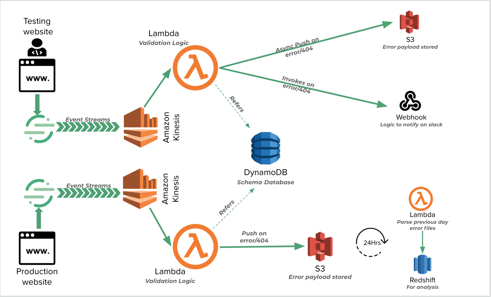

# MF-DataValidation

## Project Idea
An automated quality control service that will help data science and engineering can work together more closely, reducing time spent fixing bugs and manually QAing new data features.  This will be used with Segment (event data service).  It could be used for other data sources as well.

## Tech Stack
Segment https://segment.com/docs/spec/  
Amazon Kinesis  
Lambda   
S3  
Webhook  
Airflow  

## Data Source
Mason Finance sample json file and json schema

## Engineering Challenge
To build a resilient and fault tolerant system that is realtime as well as can handle multitude of JSON validations.

## Business Value
It directly impacts Mason Finance developer productivity by removing the need to manually QA the JSON being produced by the website events.

## MVP
* Webhook created from API-Gateway and Lambda, expecting data from Segment  
* https://api.slack.com/tutorials/aws-lambda
Ingests JSON and checks against JSON schema in DynamoDB database  
https://www.tutorialspoint.com/json/json_schema.htm
* Saves errors in the test_errors s3 bucket
* Saves successes in the test_sucess s3 bucket
* File names are the <event_name><timestamp>.json  
* Files are Gzipped
* Webhook returns error for malformed data

## Potential Architecture

## Stretch Goals
Provide a solution that does validation of various other data types apart from JSON.

## Demo

